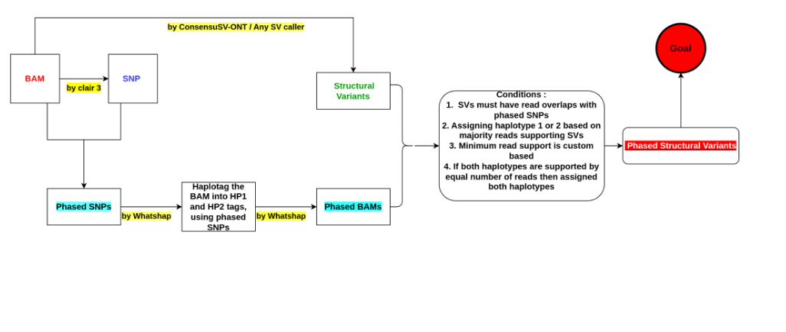

# Team5\_Phased\_SV\_Analysis

# Phasing Structural Variants Using Phased Aligned Data - BioAI Hackathon Team

---

## 🔬 Project Objective

We aim to create a state-of-the-art pipeline to **phase structural variants (SVs) in human genomes** using **phased aligned data**. Unlike traditional SV calling pipelines, we focus purely on **assigning haplotypes to pre-detected SVs** by leveraging phased SNPs and phased BAM alignments. Our workflow introduces a novel algorithm for SV-to-haplotype assignment with optional machine learning support for ambiguous cases.

---

## 🚀 System Requirements

* OS: Ubuntu 22.04 or WSL2 (recommended)
* CPU: Intel i7 9th gen or better
* RAM: 16 GB minimum (24 GB recommended)
* Disk Space: \~100 GB for large genome datasets

---

## 📀 Dataset Information

**Required Inputs:**

* Phased aligned BAM file (**must contain HP tags**)
* BAM index file (.bai)
* Phased SNP VCF file
* VCF index file (.tbi)
* Pre-called SV VCF file (from external caller e.g., Sniffles2, SVIM)

Example dataset:

* `HG00733.sorted_phased.bam`
* `HG00733.sorted_phased.bam.bai`
* `whatshap_phased.vcf.gz`
* `whatshap_phased.vcf.gz.tbi`
* `HG00733_SVs.vcf`

---

## 🛠️ Tools & Dependencies

* samtools
* bcftools
* whatshap
* minimap2
* sniffles2 (via conda)
* svim
* bedtools
* python3 + pip
* scikit-learn, pytorch/tensorflow (optional for ML enhancement)

---

## 📅 Pipeline Overview

**Note:** We do not detect SVs. We phase existing SVs using phased BAM + phased SNPs.

**Workflow Image:** Refer to  in the repo for full visual overview.

### Input Requirements

* BAM must be phased (HP tags assigned)
* Phased SNP VCF must be available
* SV VCF must be pre-detected by external tools

### Step 1: Input Validation and Preparation

* Ensure BAM has HP tags (`HP:i:1`, `HP:i:2`)
* Ensure SNP VCF and SV VCF are indexed and correspond to the same genome build

### Step 2: SV Haplotype Assignment (Novel Method)

* Extract reads supporting each SV from the phased BAM
* Assign SVs to haplotypes using following conditions:

  1. SV-supporting reads must overlap phased SNPs
  2. Assign SV to haplotype 1 or 2 based on majority of HP-tagged reads
  3. Apply minimum read support threshold (user-defined)
  4. If equal number of reads support both haplotypes, assign both or mark as ambiguous

### Step 3: Output Generation

* Create phased SV VCF file with GT and PS fields for haplotype annotation
* Merge phased SNPs and phased SVs using bcftools if required

Example:

```bash
bcftools merge whatshap_phased.vcf.gz HG00733_SVs_phased.vcf -o merged_output.vcf
```

### Step 4: Visualization & Reporting

* Visualize phased SVs in IGV or circos
* Generate key metrics:

  * Percentage of SVs phased
  * SV type distribution per haplotype
  * Concordance with SNP phased blocks

---

## 🛠️ View of Output

* Final VCF with phased SVs annotated with `HP`, `GT`, and `PS` fields
* Summary report file with:

  * Total SVs processed
  * Phased vs unphased SVs
  * Ambiguous SVs list

---

## 🎯 Optional Enhancements

* Machine learning model to resolve ambiguous SV phasing
* Add support for trio-aware SV phasing using family datasets
* Integration with Hi-C or Strand-seq data for long-range phasing improvements
* Scalability improvements for large cohort studies

---

## 📆 Future Tasks

* Finalize core `link_sv_to_hp.py` algorithm
* Integrate quality filtering module for low-confidence SVs
* Validate pipeline on trio ground-truth datasets
* Benchmark against existing methods
* Prepare final dataset + documentation for GitHub release

---

## 🛀 BioAI Ubuntu/Linux Setup Script (WSL2 or Native Linux)

```bash
#!/bin/bash
sudo apt update && sudo apt upgrade -y
sudo apt install -y build-essential wget curl git unzip python3 python3-pip parallel zlib1g-dev libbz2-dev liblzma-dev \
    samtools bcftools bedtools minimap2 whatshap htslib bwa seqtk fastqc nano htop screen tmux circos

pip3 install svim

# (Recommended) Install Sniffles2 via conda
wget https://repo.anaconda.com/miniconda/Miniconda3-latest-Linux-x86_64.sh
bash Miniconda3-latest-Linux-x86_64.sh
```

Add this to `~/.bashrc`:

```bash
export PATH="$HOME/.local/bin:$PATH"
```

---

## 📄 Common WSL/Linux Warnings (FAQ)

These warnings are safe in WSL:

```
Failed to retrieve available kernel versions.
Failed to check for processor microcode upgrades.
```

---

## 💎 requirements.txt

```txt
samtools
bcftools
bedtools
whatshap
svim
matplotlib
scikit-learn
numpy
pandas
pysam
```


---

## 📉 Novel Contributions

* First tool to phase SVs using combined phased SNPs + phased BAM read alignments
* Enables compound heterozygosity detection and allele-specific effect studies
* Solves critical gap of SV-level phasing using long-read data

---

