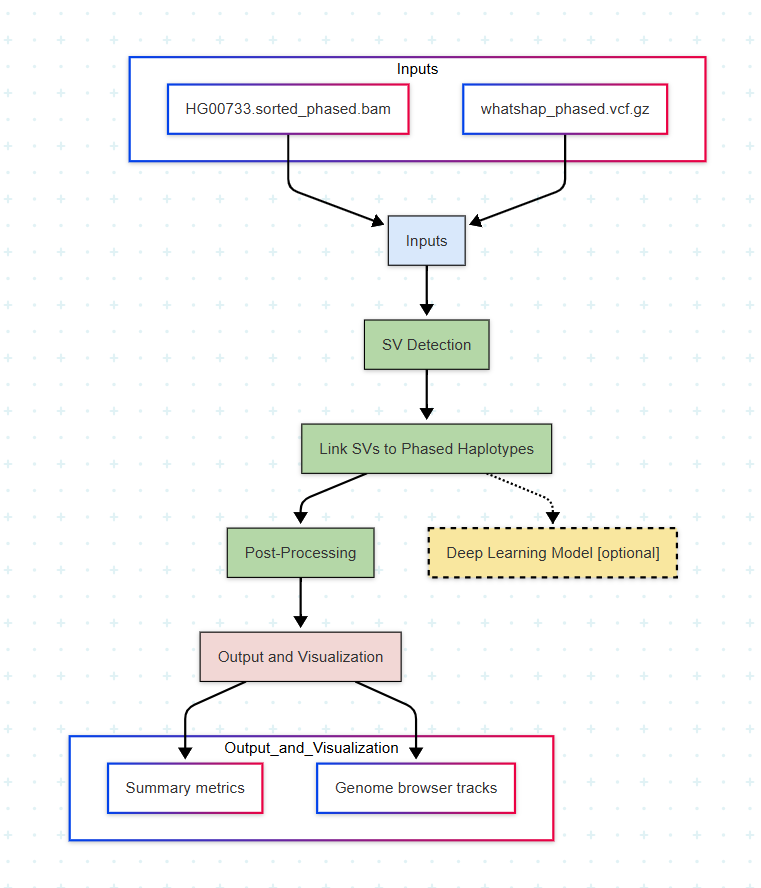

# Team5_Phased_SV_Analysis

# Phasing Structural Variants Using Phased Aligned Data - BioAI Hackathon Team

## 🔬 Project Objective

Our project aims to develop an advanced pipeline to **phase structural variants (SVs) in human genomes** using **phased aligned data**. The existing gap lies in accurately linking SVs to parental haplotypes using a combination of phased SNPs and phased BAM alignments. Our method integrates current tools and introduces a **novel step for SV-to-haplotype phasing**, with optional machine learning enhancement.

---

## 🚀 System Requirements 

* OS: Ubuntu 22.04 or other modern Linux distributions (recommended via WSL2 or native installation)
* CPU: Intel i7 9th gen or higher
* RAM: Minimum 16 GB (24 GB optimal)
* Disk Space: \~100 GB for large genome datasets

---

## 💾 Dataset Information

* `HG00733.sorted_phased.bam`: Phased aligned reads
* `HG00733.sorted_phased.bam.bai`: BAM index
* `whatshap_phased.vcf.gz`: Phased SNP VCF
* `whatshap_phased.vcf.gz.tbi`: VCF index


---

## 🛠️ Tools & Dependencies

* samtools
* bcftools
* whatshap
* minimap2
* sniffles2 (via conda)
* svim
* bedtools
* circos (optional visualization)
* python3 + pip
* Optional ML libraries (scikit-learn, pytorch/tensorflow)

---

## ✅ Pipeline Overview



> 📎 The full pipeline diagram (workflow\_diagram.png) is attached in this repository and visually explains the flow of data and analysis stages.

### Inputs

* Long-read phased BAM + phased SNP VCF

### Step 1: Structural Variant Detection

* Detect SVs using long-read BAM file:

  ```bash
  sniffles --input HG00733.sorted_phased.bam --vcf HG00733_SVs.vcf --threads 8
  ```
* Alternatively use `svim` for SV calling.

### Step 2: Novel Step — Link SVs to Phased Haplotypes

**This is our project innovation.**

* Extract HP tags from BAM to assign SV-supporting reads to haplotypes.
* Cross-validate using phased SNP VCF.
* Custom algorithm/script (`link_sv_to_hp.py`) assigns SVs to haplotype 1 or 2.
* Edge cases or ambiguous phasing resolved with optional **machine learning classifier** (deep learning or random forest).

### Step 3: Post-Processing & Validation

* Merge phased SNPs + SVs into single VCF:

  ```bash
  bcftools merge whatshap_phased.vcf.gz HG00733_SVs_phased.vcf -o merged_output.vcf
  ```
* Validate results using trio datasets.

### Step 4: Output & Visualization

* Create phased VCF + genome tracks.
* Visualize in IGV or with circos.
* Generate summary metrics:

  * % SVs phased
  * SV type distribution
  * Concordance with phased SNP blocks

### Optional Enhancements

* Integrate Hi-C data for ultra-long-range phasing.
* Apply to additional trios from 1000 Genomes Project.
* Optimize for large-cohort scalability.

---

## 💎 BioAI Ubuntu/Linux Setup Script (WSL2 or Native Linux)

```bash
#!/bin/bash

# BioAI Hackathon Starter Script v2
sudo apt update && sudo apt upgrade -y
sudo apt install -y build-essential wget curl git unzip python3 python3-pip parallel zlib1g-dev libbz2-dev liblzma-dev \
    samtools bcftools bedtools minimap2 whatshap htslib bwa seqtk fastqc \
    nano htop screen tmux circos

pip3 install svim

# For Sniffles, recommended method
# Install miniconda
wget https://repo.anaconda.com/miniconda/Miniconda3-latest-Linux-x86_64.sh
bash Miniconda3-latest-Linux-x86_64.sh
# Then manually create Sniffles conda env
```

Add this line to `~/.bashrc` to fix PATH warnings:

```bash
export PATH="$HOME/.local/bin:$PATH"
```

---

## 🐧 Common WSL/Linux Warnings (FAQ)

You may see warnings like:

```
Failed to retrieve available kernel versions.
Failed to check for processor microcode upgrades.
```

These are **expected in WSL** and do not affect performance. On native Linux, these warnings typically do not appear.

---

## ✅ Novel Contributions of Our Pipeline

* First to integrate phased BAM + phased SNPs + SV calling + machine learning for ambiguous regions.
* Enables accurate compound heterozygosity detection & allele-specific effect studies.
* Supports long-read based phasing at SV level (state-of-the-art gap).

---

## 📦 requirements.txt

```txt
samtools
bcftools
bedtools
whatshap
svim
matplotlib
scikit-learn
numpy
pandas
pysam
# (Add sniffles manually via conda)
```

---

## 📋 Next Steps

* Finalize `link_sv_to_hp.py` core algorithm.
* Validate using trio ground-truth.
* Prepare GitHub for code + results + updated documentation.

---

