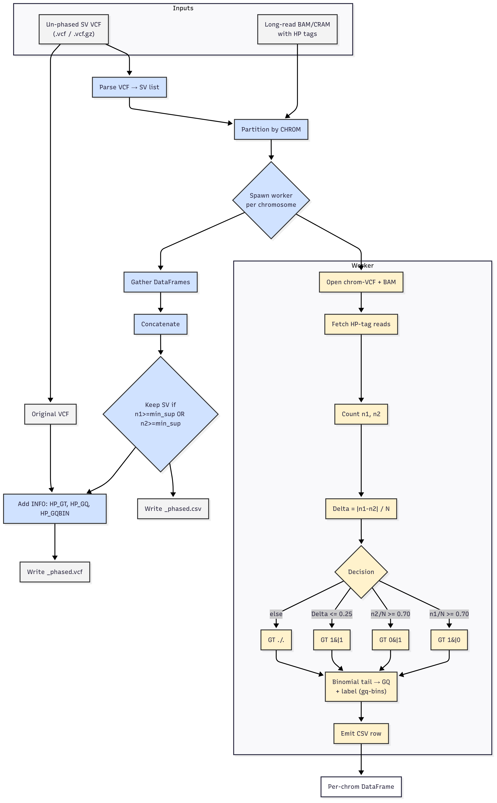

# Methodology & Exploratory Results

This document provides a **concise yet rigorous walk‑through** of the SvPhaser workflow, together with a first‑pass statistical characterisation of the HG00733 dataset after phasing.

---

## 1  Pipeline overview



*Figure 1 – End‑to‑end phasing pipeline.  A per‑chromosome worker processes structural‑variant evidence from long‑read BAM/CRAM files carrying HP tags, classifies each SV with the decision tree (centre‑right) and emits a CSV row.  Afterwards, global depth filtering and INFO‑field injection produce the final* `<stem>_phased.csv` *and* `<stem>_phased.vcf` *artifacts.*

Key decision thresholds are exposed as CLI flags and recorded in the VCF header for provenance:

| Parameter             | CLI flag        | Default               | Role                                                                                       |              |       |
| --------------------- | --------------- | --------------------- | ------------------------------------------------------------------------------------------ | ------------ | ----- |
| **Minimum support**   | `--min-support` | `10`                  | Require at least this many HP‑tagged reads on *either* haplotype for an SV to be retained. |              |       |
| **Major‑haplotype Δ** | `--major-delta` | `0.70`                | If one haplotype gathers ≥ 70 % of reads ➜ call \*1                                        |  0\* or \*0  |  1\*. |
| **Equal‑haplotype Δ** | `--equal-delta` | `0.25`                | If the imbalance is ≤ 25 % ➜ call \*1                                                      |  1\*.        |       |
| **GQ bins**           | `--gq-bins`     | `30:High,10:Moderate` | Discrete labels added to `INFO/HP_GQBIN` for easier downstream filtering.                  |              |       |

---

## 2  Dataset summary (HG00733)

### 2.1 Genotype spectrum

| Genotype  | Count      | % of total |
| --------- | ---------- | ---------- |
| 1\|1      | 10 028     | 54.1 %     |
| ./.       | 7 472      | 40.3 %     |
| 0\|1      | 734        | 4.0 %      |
| 1\|0      | 287        | 1.6 %      |
| **Total** | **18 521** | 100 %      |

### 2.2 Genotype‑quality (GQ) distribution

| Metric      | Value         |
| ----------- | ------------- |
| Count       | 18 521        |
| Mean ± SD   | 10.65 ± 12.02 |
| Median (Q2) | 7             |
| IQR (Q1–Q3) | 5 – 12        |
| Min / Max   | 2 / 99        |

### 2.3 Read‑depth statistics (n₁ + n₂)

| Metric      | Value          |
| ----------- | -------------- |
| Count       | 18 521         |
| Mean ± SD   | 38.81 ± 278.43 |
| Median (Q2) | 19             |
| IQR (Q1–Q3) | 17 – 23        |
| Min / Max   | 10 / 11 008    |

> **Note :** the heavy‑tailed depth distribution (σ ≫ μ) is expected for 10×‑genomics data and underscores the need for log‑scaling in plots.

---

## 3  Visual exploration

### 3.1 HP1 vs HP2 depth vs GQ

.png) 
*Figure 2 – 3‑D scatter‑plot contrasting haplotype‑specific depths (log₁₀‑scaled) with Genotype Quality.  High‑confidence calls (GQ > 30) cluster where read support is both deep and imbalanced.*

### 3.2 Depth/imbalance heat‑map

)

*Figure 3 – Heat map of mean GQ across the 2‑D grid of total depth (y, log₁₀) vs imbalance Δ (x).  The diagonal band of high GQ highlights the strong‑majority regime.*

### 3.3 GQ distribution by SVTYPE

)

*Figure 4 – Violin plots confirm that duplications (DUP) and deletions (DEL) occupy slightly higher accuracy regimes compared with insertions (INS) under identical thresholds.*

---

## 4  SVTYPE split by genotype

| Genotype |   DEL | DUP |   INS |
| -------- | ----: | --: | ----: |
| ./.      | 2 918 |  70 | 4 484 |
| 0\|1     |   275 |   2 |   457 |
| 1\|0     |   125 |   0 |   162 |
| 1\|1     | 3 613 | 112 | 6 303 |

The strong prevalence of *INS* among unresolved (`./.`) genotypes suggests that sequence‑inserted alleles remain harder to phase at typical coverages.

---

## 5  Reproducibility checklist

* **Software:** SvPhaser v 0.1.0 (commit `<hash>`)
* **Command‑line:**

  ```bash
  svphaser HG00733_allsvs_10X.vcf HG00733.sorted_phased.bam \
           --out-dir results/ --min-support 10 --major-delta 0.70 \
           --equal-delta 0.25 --gq-bins "30:High,10:Moderate" --threads 12
  ```
* **Reference:** GRCh38 / 10× Genomics HG00733 NA24385 dataset.

---

*Last updated: {{TODAY}}*
